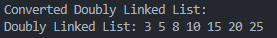

# Convert Binary Tree to Doubly Linked List (Inplace)

## **I. Problem Analysis**

### **1. Understanding the Problem**
- **Input**: A binary tree where each node contains an integer value, along with `left` and `right` pointers.
- **Output**: A doubly linked list (DLL) containing all the nodes of the tree.
  - The order of the DLL must match the **inorder traversal** of the binary tree.
  - The `left` pointer of the node will act as the `prev` pointer in the DLL.
  - The `right` pointer of the node will act as the `next` pointer in the DLL.

### **2. What is a Binary Tree?**
- A **binary tree** is a hierarchical data structure in which each node has at most two children:
  - **Left child**.
  - **Right child**.
- The topmost node is called the **root**.
- Binary trees are widely used in various algorithms, such as searching, sorting, and hierarchical storage.

#### **Example of a Binary Tree**:
```
      10
     /  \
    5    20
   / \   / \
  3   8 15  25
```

- Each node has a `value` and at most two children (`left` and `right`).

---

### **3. What is a Doubly Linked List (DLL)?**
- A **doubly linked list (DLL)** is a linear data structure consisting of nodes, where:
  - Each node contains:
    - A value (`data`).
    - A pointer to the previous node (`prev`).
    - A pointer to the next node (`next`).
- The DLL allows traversal in both forward and backward directions.
- Example of a DLL:
```
    3 <-> 5 <-> 8 <-> 10 <-> 15 <-> 20 <-> 25
```

---

### **4. Tree Traversal Algorithms**
Traversal is the process of visiting each node in a tree exactly once. There are three common traversal methods for a binary tree:
1. **Preorder Traversal (Root → Left → Right)**:
 - Visit the root first, then traverse the left subtree, and finally the right subtree.
2. **Inorder Traversal (Left → Root → Right)**:
 - Traverse the left subtree first, then visit the root, and finally the right subtree.
 - Produces sorted order for a binary search tree (BST).
3. **Postorder Traversal (Left → Right → Root)**:
 - Traverse the left and right subtrees first, then visit the root.

#### **Example on the Binary Tree:**
```
      10
     /  \
    5    20
   / \   / \
  3   8 15  25
```

- Preorder Traversal Order: `10, 5, 3, 8, 20, 15, 25`
- Inorder Traversal Order: `3, 5, 8, 10, 15, 20, 25`
- Postorder Traversal Order: `3, 8, 5, 15, 25, 20, 10`

---

### **5. Why Use Inorder Traversal?**
- **Inorder Traversal** (Left → Root → Right):
  - Guarantees that nodes in the DLL are ordered by increasing value for a binary search tree (BST).
- **Other Traversals**:
  - **Preorder (Root → Left → Right)** and **Postorder (Left → Right → Root)** do not guarantee the desired order for DLL conversion.

### **6. Algorithm Objectives**
- Traverse the binary tree **inorder**.
- Convert the binary tree into a DLL by reusing its `left` and `right` pointers:
  - `left` acts as the `prev` pointer in the DLL.
  - `right` acts as the `next` pointer in the DLL.
- Maintain pointers for:
  - **`head`**: Points to the first node of the DLL.
  - **`prev`**: Tracks the previous node in the DLL for linking.

---

## **II. Algorithm Design**

### **1. High-Level Steps**
1. Use an **inorder traversal** to visit nodes in the required order.
2. For each visited node:
   - If it is the first node, set it as the `head` of the DLL.
   - Otherwise, link it to the `prev` node:
     - `node->left = prev` (set the `prev` pointer).
     - `prev->right = node` (set the `next` pointer).
   - Update `prev` to the current node.
3. Return the `head` pointer to access the DLL.

---

### **2. Algorithm Complexity**
- **Time Complexity**:  
  - Visiting each node once → **O(n)** (where `n` is the number of nodes in the binary tree).
- **Space Complexity**:  
  - Recursion stack depends on the height of the tree → **O(h)** (where `h` is the height of the tree).
  - For a balanced tree, `h ≈ log(n)`. For a skewed tree, `h ≈ n`.

---

## **III. Pseudocode**

### **Input**:
- A binary tree `root` where each node contains:
  - `data`: The value of the node.
  - `left`: Pointer to the left child.
  - `right`: Pointer to the right child.

### **Output**:
- A doubly linked list where nodes are linked in increasing order based on **inorder traversal**.

---

### **Algorithm**:

#### **Function to Convert Binary Tree to DLL**

    **CONVERT_TO_DLL(root, head, prev): If root is NULL: Return**

    // Step 1: Convert left subtree
    CONVERT_TO_DLL(root.left, head, prev)

    // Step 2: Process current node
    If prev is NULL:
        // This is the first node
        head = root
    Else:
        // Link current node with previous node in DLL
        root.left = prev
        prev.right = root
    prev = root // Update prev to current node

    // Step 3: Convert right subtree
    CONVERT_TO_DLL(root.right, head, prev)

---

#### **Function to Print the DLL**

    **PRINT_DLL(head): current = head While current is not NULL: Print current.data current = current.right**

---

#### **Function to Print DLL in Reverse**

    **PRINT_DLL_REVERSE(head): If head is NULL: Return**

    // Traverse to the last node
    current = head
    While current.right is not NULL:
        current = current.right

    // Traverse backward from the last node
    While current is not NULL:
        Print current.data
        current = current.left

---

#### **Main Function**

    **MAIN(): head = NULL // Pointer to the head of the DLL prev = NULL // Pointer to track the previous node**

    // Convert the binary tree into a doubly linked list
    CONVERT_TO_DLL(root, head, prev)

    // Print the resulting DLL
    PRINT_DLL(head)

    // Optionally, print the DLL in reverse
    PRINT_DLL_REVERSE(head)

---

## **IV. Example**

#### **Binary Tree example**:
```
      10
     /  \
    5    20
   / \   / \
  3   8 15  25
```

#### **Input**:
- The root of the binary tree.

#### **Expected Output (DLL):**:
3 <-> 5 <-> 8 <-> 10 <-> 15 <-> 20 <-> 25

---

## **V. Implement in C**

### **Project's Structure**

#### **Folders and Files**:
1. **DSA_Report**:
   - **Description**:
     - `Problem.txt`: Contains the problem description and requirements.
     - `Requirements.txt`: Explains the requirements professor gave.
   - **src**:
     - `Solution.c`: Contains the main source code implementing the algorithm to convert a binary tree into a doubly linked list (DLL).

2. **Input and Output**:
   - **Input**:
     - The binary tree represented as a structure, where each node has the attributes `data`, `left`, and `right`.
     - Example Binary Tree:
       ```
             10
            /  \
           5    20
          / \   / \
         3   8 15  25
       ```
   - **Expected Output**:
     ```
     Doubly Linked List: 3 <-> 5 <-> 8 <-> 10 <-> 15 <-> 20 <-> 25
     ```
    - **Actual output**:
        

---

### **Key Features**:
1. **Inplace Conversion**:
   - Reuses the `left` and `right` pointers of the tree nodes to create the DLL.
   - No additional data structures required.
   
2. **Time Complexity**:
   - O(n), where `n` is the number of nodes in the binary tree.
   
3. **Space Complexity**:
   - O(h), where `h` is the height of the tree (due to the recursion stack).

---

## **VI. Summary**

- **Algorithm**: Uses inorder traversal to maintain the order of elements in the resulting DLL.
- **Inplace Conversion**: Reuses the original tree nodes, minimizing memory usage.
- **Time Complexity**: O(n), where `n` is the number of nodes in the tree.
- **Space Complexity**: O(h), where `h` is the height of the tree (recursion stack).

